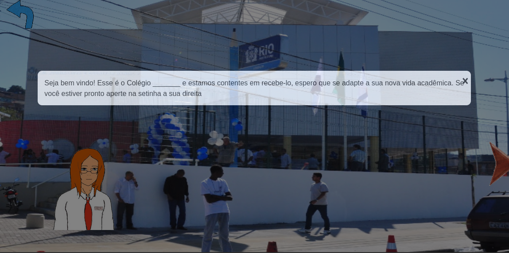
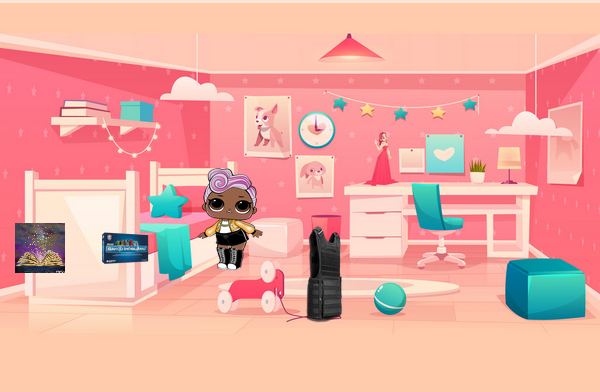
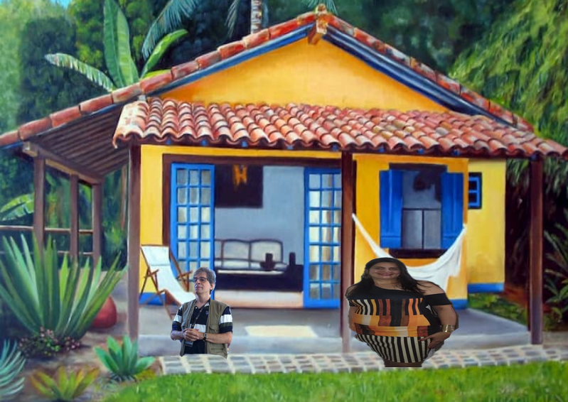
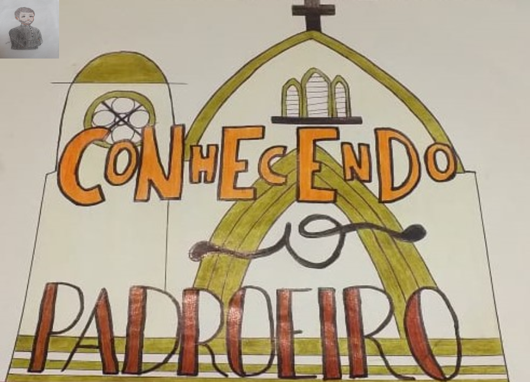
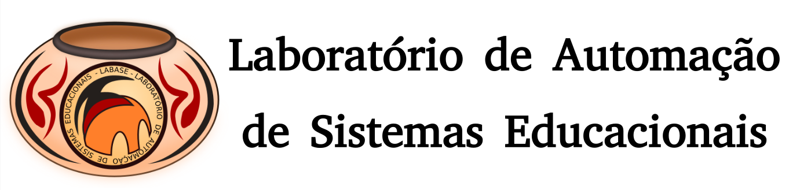

.. SupyPlay documentation master file, created by
   sphinx-quickstart on Wed Jul 13 16:23:41 2022.
   You can adapt this file completely to your liking, but it should at least
   contain the root `toctree` directive.

Bem vindo ao SupyPlay!
====================================

Jogos produzidos por alunos de Costa Barros

+---------------+---------------+---------------+---------------+
| :ref:`em_fe`  | :ref:`en_bu`  | :ref:`jo_ge`  | :ref:`sn_je`  |
+===============+===============+===============+===============+
| |EmpoderaIM|  |  |BullyingIM| | |GeneticaIM|  |  |JeronimoIM| |
+---------------+---------------+---------------+---------------+
| |EmpoderaQR|  | |BullyingQR|  | |GeneticaQR|  | |JeronimoQR|  |
+---------------+---------------+---------------+---------------+

.. toctree::
   :maxdepth: 1
   :caption: Conteúdo:

   intro.rst
   genetica.rst
   empodera.rst
   bullying.rst
   jeronimo.rst

Índices e tabelas
==================

* :ref:`genindex`
* :ref:`modindex`
* :ref:`search`

-------

Laboratório de Automação de Sistemas Educacionais
-------------------------------------------------

**Copyright © Carlo Olivera**

LABASE_ - NCE_ - UFRJ_

|LABASE|

.. _LABASE: http://labase.activufrj.nce.ufrj.br
.. _NCE: http://nce.ufrj.br
.. _UFRJ: http://www.ufrj.br

.. _Projeto Games Costa Barros: https://activufrj.nce.ufrj.br/community/Games_Costa_Barros

.. |EmpoderaQR| image:: _static/bit.ly_g_empodera.png
   :width: 100px
   :target: https://bit.ly/sp_empodera

.. |github| image:: https://img.shields.io/badge/release-22.07-blue
   :target: https://github.com/labase/supyplay/releases

.. |Daniel Pisa| image:: https://i.imgur.com/wRPm7BZ.png
   :target: https://activufrj.nce.ufrj.br/community/Games_Costa_Barros
   :alt: Games Costa Barros
   :width: 800px

.. |python| image:: https://img.shields.io/github/languages/top/kwarwp/kwarwp
   :target: https://www.python.org/downloads/release/python-383/

.. |docs| image:: https://img.shields.io/readthedocs/supygirls
   :target: https://supygirls.readthedocs.io/en/latest/index.html

.. |license| image:: https://img.shields.io/github/license/labase/supyplay
   :target: https://raw.githubusercontent.com/labase/supyplay/main/LICENSE

.. _Jogo da Genética: https://bit.ly/sp_genes
.. _Empoderamento: https://bit.ly/sp_empodera
.. _Bullying: https://bit.ly/sp_bully
.. _Jeronimo: https://bit.ly/sp_jeronimo
