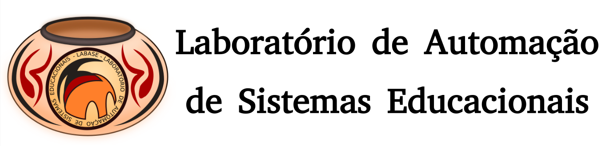
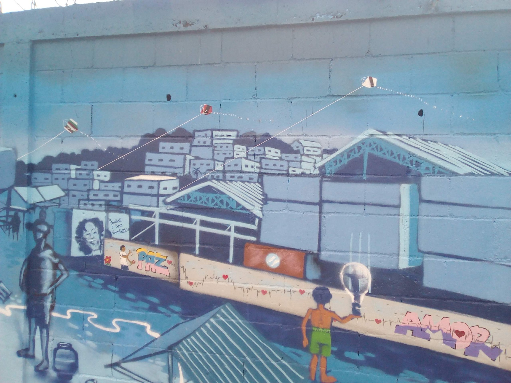

Games da Comunidade de Costa Barros
===================================

|Costa Barros|

Visão Geral
===========

O projeto de SuperPython Resgate ocorre na Escola Municipal Jornalista e Escritor Daniel Piza,
localizada na zona norte da cidade do Rio de Janeiro, numa das entradas para a comunidade
do Complexo da Pedreira, localizada entre os bairros Acari e Costa Barros, que de acordo com
os dados mais recentes do Instituto Brasileiro de Geografia e Estatística (IBGE), ocuparam
respectivamente o 124º e 125º lugar das 126 regiões analisadas na cidade do Rio de Janeiro.
Este projeto atende uma população de crianças e adolescentes, que vivem em área de
alta vulnerabilidade social e perdura por mais de seis anos, levando inovação, ciência e tecnologia
para crianças e adolescentes que moram nessa região.

-------

Laboratório de Automação de Sistemas Educacionais
-------------------------------------------------

**Copyright © Carlo Olivera**

LABASE_ - NCE_ - UFRJ_

|LABASE|

.. _LABASE: http://labase.activufrj.nce.ufrj.br
.. _NCE: http://nce.ufrj.br
.. _UFRJ: http://www.ufrj.br

.. _Projeto Games Costa Barros: https://activufrj.nce.ufrj.br/community/Games_Costa_Barros

.. |github| image:: https://img.shields.io/badge/release-22.07-blue
   :target: https://github.com/labase/supyplay/releases

.. |Daniel Pisa| image:: https://i.imgur.com/wRPm7BZ.png
   :target: https://activufrj.nce.ufrj.br/community/Games_Costa_Barros
   :alt: Games Costa Barros
   :width: 800px

.. |python| image:: https://img.shields.io/github/languages/top/kwarwp/kwarwp
   :target: https://www.python.org/downloads/release/python-383/

.. |docs| image:: https://img.shields.io/readthedocs/supygirls
   :target: https://supygirls.readthedocs.io/en/latest/index.html

.. |license| image:: https://img.shields.io/github/license/labase/supyplay
   :target: https://raw.githubusercontent.com/labase/supyplay/main/LICENSE

